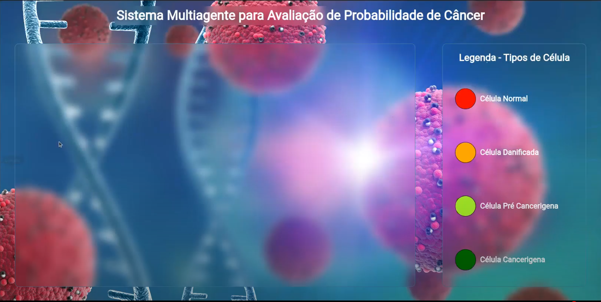
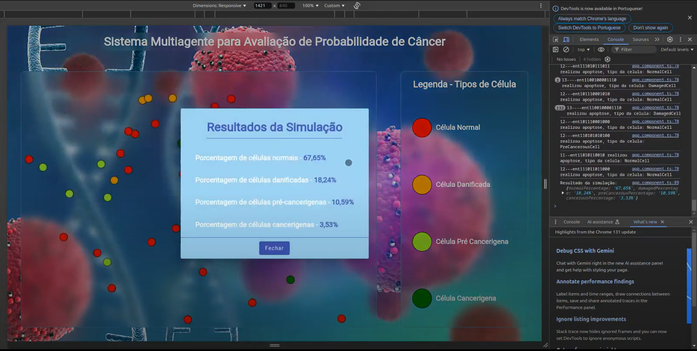

# Simulação de multiplicação celular e desenvolvimento do câncer

**Disciplina**: FGA0134 - Sistemas Multiagentes <br>
**Nro do Grupo**: 07<br>
**Frente de Pesquisa**: SMA no domínio da saúde - Crescimento celular e desenvolvimento do câncer<br>

## Alunos
|Matrícula | Aluno |
| -- | -- |
| 20/2016168  |  Eric Camargo da Silva |
| 20/2016524  |  Henrique Torres Landin |
| 20/2063346  |  Jose Filipi Brito Souza |
| 21/1029399  |  Kauã Vinícius Ponte Aguiar |

## Sobre 

Este projeto utiliza **sistemas multiagentes** para simular o comportamento de tecidos cancerígenos, empregando a plataforma **JADE** (Java Agent DEvelopment Framework). Nesta abordagem, cada célula é modelada como um agente autônomo, replicando padrões biológicos de crescimento, mutação e morte celular. O objetivo principal é desenvolver um modelo que ajude na compreensão de dinâmicas celulares em tecidos cancerígenos, além de se aprofundar mais nos conceitos que envolvem sistemas multiagentes.  

### Tecnologias  

- **JADE**: Framework para desenvolvimento de sistemas multiagentes em Java.  
- **Java**: Linguagem principal para o desenvolvimento do simulador.  
- **NodeJs e Angular**: Frameworks javascript utilizados para produzir a interface gráfica.  

## Screenshots  
  
**Legenda:** Interface gráfica do sistema.  

  
**Legenda:** Resultado da simulação.  


## Instalação 
**Linguagens**: Java, TypesScript<br>
**Tecnologias**: JADE, NestJS (Frameword de NodeJs) e Angular<br>


## Uso 
1. **Rodar a API**:
   - Entre no diretório `/cancer-evolution-api`
   - Intale as dependências com o comando:
     ```bash
     pnpm install
     ```
   - Rode a aplicação com o comando:
     ```bash
     pnpm run start
     ```
     
2. **Rodar o Frontend**:
   - Entre no diretório `/cancer-evolution-frontend`
   - Intale as dependências com o comando:
     ```bash
     npm install
     ```
   - Rode a aplicação com o comando:
     ```bash
     npm start
     ```

3. **Inicie a plataforma JADE**:
   - Entre no diretório `/cancer-evolution-simulation`
   - Execute o script ou comando para iniciar a plataforma JADE no terminal:
     ```bash
     java -cp jade.jar;classes jade.Boot -gui
     ```

5. **Adicione um agente célula**:
   - No terminal do JADE, use o comando:
     ```bash
     addAgent CellAgent:Agent.CellAgent(InitialCellState, Generation)
     ```
     Exemplo:
     ```bash
     addAgent CellAgent:Agent.CellAgent(Normal, 0)
     ```

### Funcionamento do projeto (Por padrão)

- **Divisão celular**:
  - A cada 4 "dias" (simulados), células normais e danificadas podem se dividir, gerando novas células-filhas.
  - Limitação: O número total de agentes não pode exceder 100. Quando atingido, metade dos agentes será removida.

- **Apoptose celular**:
  - Células danificadas ou pré-cancerosas podem entrar em apoptose (morte celular programada).

- **Reparo celular**:
  - Células danificadas podem ser reparadas, revertendo ao estado normal.

- **Finalização da simulação**:
  - Após 60 "dias" (simulados), a simulação termina automaticamente.
  - Um relatório de percentual de células por estado é gerado.

### Parâmetros Modificáveis

Os seguintes parâmetros podem ser ajustados no código para personalizar a simulação:

1. **`DAYS_TO_RUN`**:
   - Descrição: Número total de dias simulados.
   - Padrão: `60`.

2. **`MAX_AGENTS`**:
   - Descrição: Número máximo de agentes simultâneos permitidos.
   - Padrão: `100`.

3. **`DIVISION_INTERVAL`**:
   - Descrição: Intervalo de tempo (em dias simulados) para divisão celular.
   - Padrão: `4`.

4. **`GENETIC_PREDISPOSITION`**:
   - Descrição: Percentual de chance de uma célula danificada evoluir para um estado pré-canceroso.
   - Padrão: `10%`.

5. **`HTTP_ENDPOINT`**:
   - Descrição: URL para a qual os dados da simulação são enviados.
   - Padrão: `http://localhost:3000`.

6. **`STATE_CHANGE_PROBABILITIES`**:
   - Descrição: Probabilidades de transição entre os estados celulares (danificada, pré-cancerosa, etc.).
   - Padrão: Definido no código conforme as regras biológicas.

Para alterar esses valores, edite o arquivo de configuração ou as variáveis correspondentes no código.


## Vídeo da apresentação
[](https://www.youtube.com/watch?v=2YAa3Sa1OaM)

## Participações
|Nome do Membro | Contribuição | Significância da Contribuição para o Projeto (Excelente/Boa/Regular/Ruim/Nula) | Comprobatórios
| -- | -- | -- | -- |
|  Eric  |  N/A  |  Nula  |  N/A  |
|  Henrique  | Desenvolvimento de uma API para integração com o frontend (via WebSocket) e com o sistema JADE (via HTTP). Implementação do frontend da aplicação e ajustes no código do JADE para compatibilidade com a API.   |  Excelente  |  [6ce87f1](https://github.com/UnBSMA2024-2/2024.2_G7_SMA_DominioSaude/commit/6ce87f1d86fc6c29ea41059433e5f1d8cb91d4f6)  |
|  José Filipi  |  Ajuste na simulação com implementação de limitação de agentes, questões de temporização e feedback de resultados da simulação e organização inicial da temática  | Excelente  | [8eeaf9a](https://github.com/UnBSMA2024-2/2024.2_G7_SMA_DominioSaude/commit/8eeaf9a5ddcfda9c2b350760e22df0d082279e9b)
| Kauã  | Codificação do agente célula e implementação dos estados | Excelente | [96ad532](https://github.com/UnBSMA2024-2/2024.2_G7_SMA_DominioSaude/commit/96ad5329c7812d907ff10f0a73071bcbd7582111)

## Outros 
### Lições Aprendidas
- **Aprendizado sobre Sistemas Multiagentes**: O desenvolvimento permitiu aprofundar o conhecimento em sistemas multiagentes e a utilização prática do framework JADE.  
- **Biologia e Computação**: Foi possível compreender como conceitos biológicos, como divisão celular e apoptose, podem ser modelados computacionalmente.  
---

#### Fragilidades
1. **Escalabilidade Limitada**: A capacidade máxima de agentes é restrita pelo desempenho do ambiente JADE e da máquina que executa o sistema.  
2. **Simplificação**: As probabilidades de transição entre estados celulares são fixas, o que pode limitar a representatividade de cenários reais, além disso, não representa a complexidade celular completa, sendo necessário englobar muitos outros conceitos para enriquecer a simulação e aumentar a confiabilidade.  

## Fontes

**AMORIM, Aline Rodrigues.** *Genética do Câncer.* 2002. Monografia (Licenciatura em Ciências Biológicas) – Faculdade de Ciências da Saúde, Centro Universitário de Brasília, Brasília, 2002. Orientador: Cláudio Henrique Cerri e Silva. Disponível em: https://repositorio.uniceub.br/jspui/bitstream/123456789/2497/2/9864661.pdf. Acesso em: 6 jan. 2025.

ANAND, Ashish; SUGANTHAN, P. N. Multiclass cancer classification by support vector machines with class-wise optimized genes and probability estimates. Journal of Theoretical Biology, v. 259, n. 3, p. 533–540, 7 ago. 2009. Disponível em: https://www.sciencedirect.com/science/article/abs/pii/S0022519309001854. Acesso em: 6 jan. 2025.

BATISTA, André Filipe de Moraes. Manual Complementar do Projeto de Pesquisa: Sistemas Multiagentes na Construção de um Middleware para Suporte a Ambientes Computacionais. Orientação: Profa Dra Maria das Graças Bruno Marietto. Universidade Federal do ABC, Santo André, ago. 2008. Disponível em: https://jade-project.gitlab.io/docs/ManualJadePortuguese.pdf. Acesso em: 6 jan. 2025.

TATARI, Farzaneh; AKBARZADEH-T, Mohammad-R.; SABAHI, Ahmad. Fuzzy-probabilistic multi-agent system for breast cancer risk assessment and insurance premium assignment. Journal of Biomedical Informatics, v. 45, n. 6, p. 1021–1034, dez. 2012. Disponível em: https://www.sciencedirect.com/science/article/pii/S1532046412000883. Acesso em: 6 jan. 2025.
